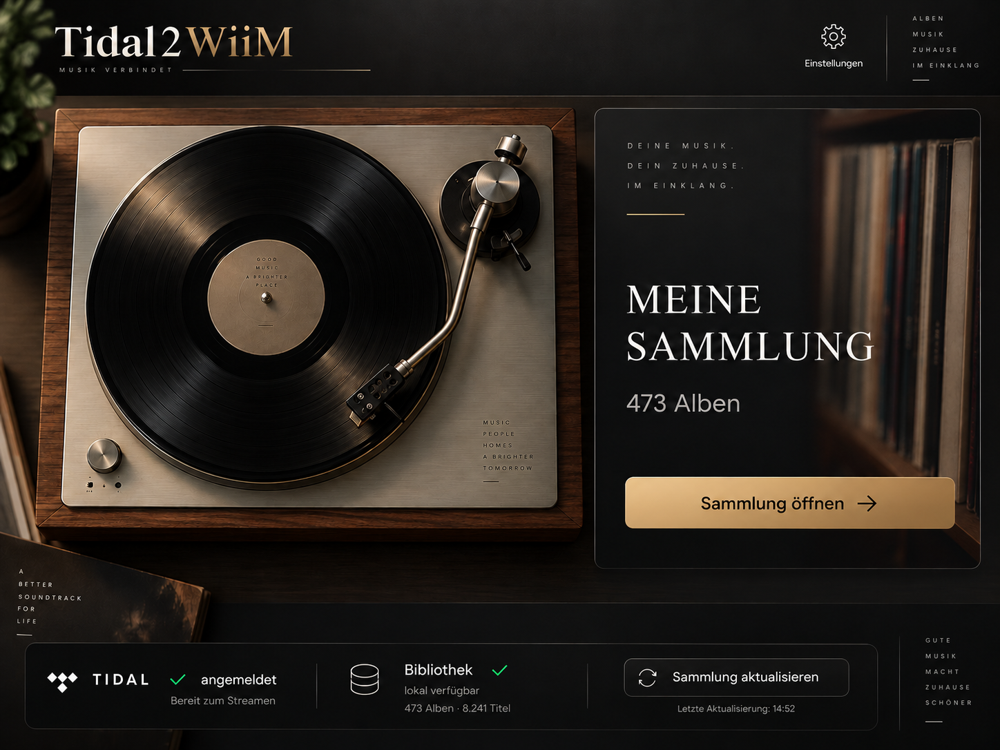
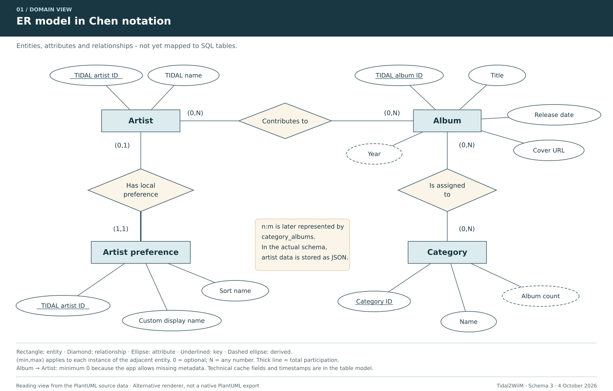
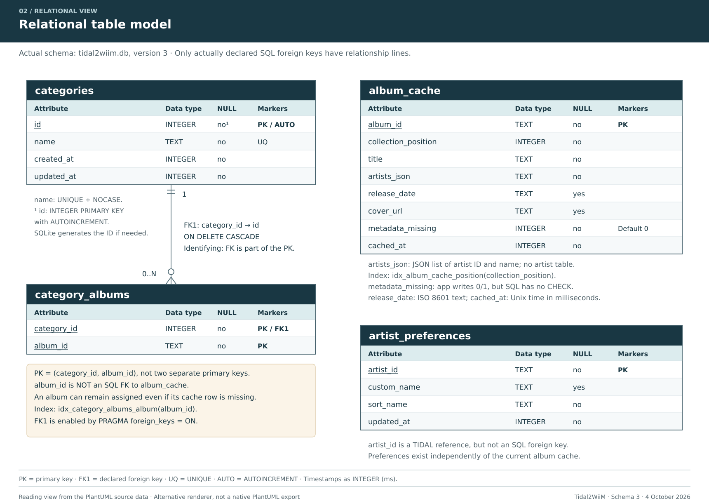

# Tidal2WiiM

**A personal digital record shelf for TIDAL — developed with Flutter for an Android tablet.**

*The title image uses the app's start-screen artwork. The numbers in the image are part of the design.*

*This English version is translated from the [German source repository](https://github.com/Code4OvM/tidal2wiim-demo); the technical content is unchanged.*

## How the Project Started

I listen to music through TIDAL and a WiiM Pro -> Fosi Audio ZH3 -> Fosi Audio ZA3. As my album collection grew, however, I was missing a way to organise my music as I would on a record shelf: by artists and bands, with their albums clearly arranged in one place.

TIDAL offers playlists, but no freely customisable folder structure for this kind of album management. Its integration into the WiiM app did not fill this gap for me either: it uses the library and metadata provided by TIDAL, but does not add the personal organisation I wanted.

This led to the idea of **Tidal2WiiM as the “missing link” between a streaming library and a personal record shelf**. The app groups albums into artist and band folders and adds personal categories and individually customisable display and sort names. This makes it possible to browse and manage the collection according to your own preferences — and then open the selected music in TIDAL.

Development progressed step by step with support from ChatGPT for testing and troubleshooting: first a working Flutter app on the tablet, then TIDAL sign-in and access to the collection. Artist folders, categories, album details and opening selections in TIDAL followed. Practical use led to further improvements, such as local caches, a persistently saved sign-in session and a dedicated artist editor.

The app's appearance was also intended to feel like a music collection. ChatGPT therefore created the start screen with its turntable and record shelf, along with the matching app icon. A little hi-fi nostalgia is part of the experience, after all.

## Implemented Features

| Area | Implemented features |
| --- | --- |
| **TIDAL integration** | Sign in to your own TIDAL account and load all saved albums page by page. |
| **Cover overview** | View the collection with album covers, album titles, artists and release years. |
| **Search and sorting** | Search the collection and sort albums in different ways, including by artist and year. |
| **Artist folders** | Automatically group albums by artist, with A–Z navigation. |
| **Custom artist names** | Local display and sort names, with an additional editor for editing artist sort names together. |
| **Custom categories** | Create, rename and delete categories, and assign albums to one or more categories. |
| **Album details** | A detail view with the cover, album information and track list. |
| **Opening selections in TIDAL** | Open a complete album or an individual track directly in the TIDAL app. |
| **Local storage** | Store album metadata in SQLite and covers as local files, and reuse them on the next launch. |
| **Refreshing the collection** | Synchronise the local library with TIDAL and add newly saved albums. |
| **Keeping the user signed in** | Store the session securely, restore it when the app starts and refresh access tokens when required. |
| **Tablet interaction** | A dedicated start screen, separate collection and settings views, an app icon and dismissal of the on-screen keyboard when opening a search result. |

Personal categories and artist customisations are stored locally. They do not change the metadata held by TIDAL. An album involving several artists can therefore appear in several artist folders.

## How Playback Works

1. Select an album or track in **Tidal2WiiM**.
2. The selection is passed to TIDAL and opened in the **TIDAL app**.
3. Tap **▶** there and use the **WiiM through TIDAL Connect** as the output device.

Tidal2WiiM handles organisation and selection. The TIDAL app starts playback and connects to the WiiM. In the current version, the additional tap on ▶ is still required.

The name describes this usage workflow. The app does not include its own audio player or direct WiiM control. The local cache contains metadata and covers, not downloaded music files.

## Deliberate Design Decisions

- **Albums are the focus.** The interface is designed for browsing your own collection.
- **A–Z navigation for artists.** Search and sorting are sufficient in the album overview; an additional letter bar was deliberately omitted there.
- **Local data for faster subsequent launches.** The collection and its covers, once loaded, do not need to be downloaded again in full every time the app starts.
- **One account, one personal record shelf.** The app is designed for one TIDAL account and one local dataset; multi-user management is outside its feature set.

## Why There Is a Separate Settings Area

When listening to music, the collection, its covers and the choice of an album are the focus. Sign-in, connection checks and reloading the library are needed less frequently. These functions are therefore available through **Settings** in a separate area called **“Labor”** in the app. This keeps the regular music view clear while bringing together the technical status information needed for troubleshooting.

The separate **“Künstler-Sortiernamen bearbeiten”** page for editing artist sort names can also be opened there. It addresses a common organisation problem: the artist name supplied by TIDAL does not always produce the desired alphabetical position on a personal record shelf. **“Nils Wülker”**, for example, should still be displayed as that name, but should appear under **W** through the sort name **“Wülker, Nils”**. Display and sorting can therefore be set independently.

The dedicated editing page brings several artists and bands together in one list. Their sort names can be maintained together without having to open each artist folder in turn. This occasional administrative task has its own place under Settings, while the collection remains focused on browsing and selecting music.

The customisations are stored locally in SQLite and do not change any TIDAL metadata. If the library is already available on the tablet, editing sort names does not require an active TIDAL sign-in.

## Tools and Technologies

Development took place on **Windows** for an **Android tablet**, with practical testing on an **LZF ZPad1A**, preferably in landscape orientation.

| Tool / technology | Use in the project |
| --- | --- |
| **Flutter** | Building the app interface: start screen, cover overview, navigation, dialogs and detail views. |
| **Dart** | Programming language for the interface and app logic, including search, sorting, data models and API access. |
| **SQLite / `sqflite`** | Local database for categories, album assignments, artist customisations and cached album metadata. `sqflite` integrates SQLite into the Flutter app. |
| **Visual Studio Code** | Development environment for editing the source code, running the app and investigating errors. |
| **Android SDK and ADB** | Android tools for building the app and connecting to the tablet, installing the app and diagnosing issues over USB or Wi-Fi. |
| **Gradle** | Build system for the Android part of the app and for integrating native dependencies when creating the APK. |
| **TIDAL API / HTTP** | Retrieving the personal album collection and information about albums, artists and tracks. HTTP requests are made through the Dart package `http`. |
| **Git and GitHub** | Version control and source-code storage, making changes and their development traceable. |
| **Flutter testing tools** | Automated tests for session management, artist sorting and parts of the interface, supplemented by practical tests on the tablet. |
| **PlantUML** | Textual descriptions of the conceptual ER model and the relational table model; the source files are included for understanding and further editing. |
| **ChatGPT** | Support with dividing the code into functional parts, testing, troubleshooting, graphic design and documentation; the app was developed step by step around its actual use on the tablet. |

Additional Flutter packages are used for specific tasks:

- **`flutter_appauth`** handles the OAuth sign-in flow for TIDAL.
- **`flutter_secure_storage`** stores session data using the platform's secure storage.
- **`url_launcher`** opens selected album and track links in an external application, in this case the TIDAL app.

Storage tasks are separated: **SQLite stores structured data**, **covers are held as local image files**, and **credentials are stored through the platform's secure storage**. Music files are not stored.

The source code is divided into models, data access, services, pages and widgets.

## Data Models as a Learning Example

The app demonstrates why an application using an external API still needs a **local database**: TIDAL supplies the music metadata, while personal organisation takes place on the tablet. SQLite permanently stores custom categories, album assignments and artist preferences. An additional metadata cache makes it possible to display the previously loaded collection quickly on the next launch.

Learners can use this example to trace the path from requirements to concrete storage. A **planning model** helps clarify entities, attributes, relationships and cardinalities before tables and program code are created. It also helps assess the effects of a change during further development.

The two existing models document the project as of **4 October 2026, using SQLite schema 3**.

### Conceptual ER Model in Chen Notation

Which objects does the app manage, what properties do they have and how are they related? This model presents the conceptual view of albums, artists, categories and personal artist preferences.

[Full-size view](docs/datenmodell/Leseansichten/01_ER_Modell_Chen_Leseansicht.svg) · [PlantUML source](docs/datenmodell/PlantUML/01_ER_Modell_Chen.puml)

### Relational Table Model for SQLite

How is this information actually stored? The second model shows the tables, data types, keys and the declared foreign-key relationship. The notes also highlight the differences between the conceptual model and the implementation: a conceptual relationship is not automatically enforced by an SQL foreign key.

[Full-size view](docs/datenmodell/Leseansichten/02_Relationales_Tabellenmodell_Leseansicht.svg) · [PlantUML source](docs/datenmodell/PlantUML/02_Relationales_Tabellenmodell.puml)

For use in class: [Both views as a PDF](docs/datenmodell/Tidal2WiiM_Datenmodelle_Leseansicht.pdf) · [Database implementation in the source code](lib/data/lokale_datenbank.dart)

## Documentation and Code Atlas

The code atlas describes the responsibilities of the 19 Dart modules, their connections and the exchange of data. Class and sequence diagrams complement the existing ER and table models.

- [Documentation overview](docs/README.md) — an introduction to the code atlas and data models.
- [Code atlas and reading path](docs/codeatlas/README.md) — architecture, module handbook and data exchange.
- [Module overview](docs/codeatlas/00_Kurzueberblick.md) — each module, its responsibility and a link to its profile.
- [Class and sequence diagrams](docs/codeatlas/04_Diagrammuebersicht.md) — 14 models with rendered views and PlantUML sources.
- [Code atlas as a PDF](docs/codeatlas/Tidal2WiiM_Codeatlas_2026-10-08.pdf) — a continuous reading edition, version dated 8 October 2026.

## Project Status

Tidal2WiiM grew out of a personal need and is used on my own tablet. The core features for the collection, organisation and opening selections in TIDAL have been implemented. The repository documents this stage of development and provides the basis for further improvements arising from everyday use.

*Independent personal project; not an official application of TIDAL or WiiM.*

## Licensing and Reuse

The documentation, data models and graphics created for this project are licensed under [Creative Commons Attribution–NonCommercial 4.0 International (CC BY-NC 4.0)](https://creativecommons.org/licenses/by-nc/4.0/deed.de). They may be used, copied, shared and adapted for non-commercial purposes. **Frank / Code4OvM**, the source and the licence must be credited, and changes must be identified.

The app's own **source code** is licensed under the [PolyForm Noncommercial License 1.0.0](https://polyformproject.org/licenses/noncommercial/1.0.0). Subject to its terms, it permits use, modification and distribution for non-commercial purposes and explicitly permits use by educational institutions. Licence notices and required rights notices must be retained when distributing the code.

Required Notice: Copyright 2026 Frank / Code4OvM (https://github.com/Code4OvM)

These permissions apply only to the extent that the project author holds the relevant rights. Included libraries, third-party content, and third-party trademarks and logos remain subject to their respective rights and licence terms.
