# Diagrams

[Code Atlas](README.md) · [Documentation overview](../README.md)

All graphics were generated natively from the included PlantUML sources.

## 01 · Responsibilities and data flows

The app processes metadata and personal organisation. The music stream and WiiM control are outside its Dart code.

**Source locations:** main.dart; pages/home_page.dart; services/*; data/*

[PlantUML](PlantUML/01_Komponenten.puml) · [SVG](SVG/01_Komponenten.svg) · [PNG](PNG/01_Komponenten.png)

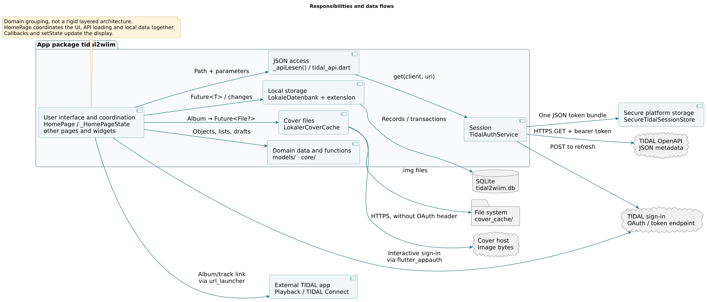

## 02 · Domain models in memory

Objects, domain relationships and SQL tables are different views. Of particular importance: categories store IDs, and album tracks exist only in the detail page state.

**Source locations:** models/modelle.dart; core/sammlung.dart

[PlantUML](PlantUML/02_Klassen_Datenmodelle.puml) · [SVG](SVG/02_Klassen_Datenmodelle.svg) · [PNG](PNG/02_Klassen_Datenmodelle.png)

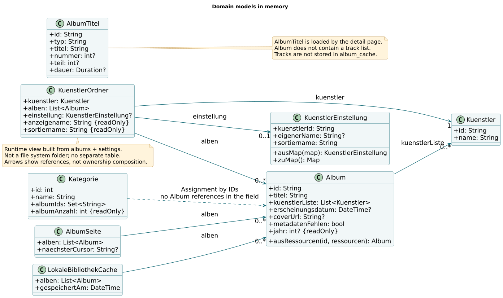

## 03 · Session management and testability

The store, clock and HTTP client are interchangeable. Expiry times, storage failures and concurrent requests can therefore be tested without real TIDAL access.

**Source locations:** services/tidal_auth_service.dart; test/support/memory_session_store.dart

[PlantUML](PlantUML/03_Klassen_Sitzung.puml) · [SVG](SVG/03_Klassen_Sitzung.svg) · [PNG](PNG/03_Klassen_Sitzung.png)

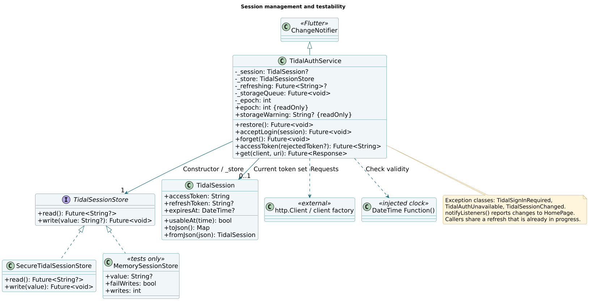

## 04 · Artist editor: input, draft and storage

The draft separates provisional input from the stored state. A Dart extension is not inheritance and therefore has no generalisation arrow.

**Source locations:** models/kuenstler_sortierung.dart; pages/kuenstler_sortiernamen_page.dart; data/kuenstler_sortierung_speichern.dart

[PlantUML](PlantUML/04_Klassen_Kuenstlereditor.puml) · [SVG](SVG/04_Klassen_Kuenstlereditor.svg) · [PNG](PNG/04_Klassen_Kuenstlereditor.png)

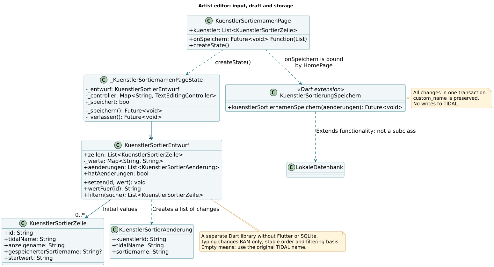

## 05 · User interface: objects and callbacks

Widgets receive data and functions through constructors. A callback can trigger a reload of the parent view after saving.

**Source locations:** main.dart; pages/*; widgets/album_grid.dart; widgets/album_cover.dart

[PlantUML](PlantUML/05_Klassen_Oberflaeche.puml) · [SVG](SVG/05_Klassen_Oberflaeche.svg) · [PNG](PNG/05_Klassen_Oberflaeche.png)

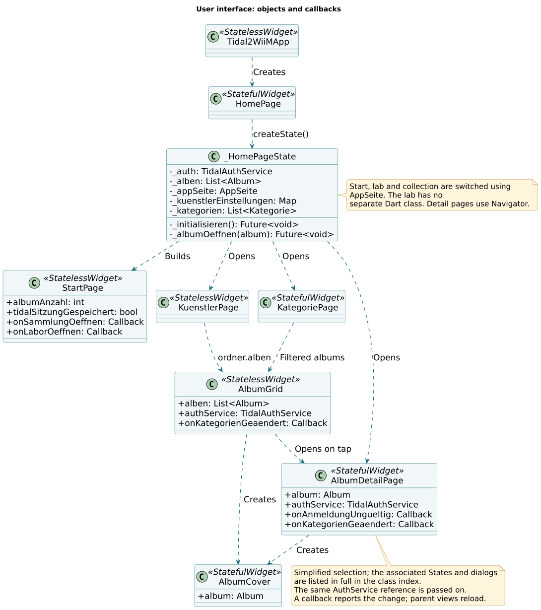

## 06 · App startup: cache and stored session

Two asynchronous tasks start together. A loaded cache is displayed independently of the completion of a later network update; tokens and albums are read separately.

**Source locations:** pages/home_page.dart: _initialisieren(), _bibliothekAusCacheLaden(); services/tidal_auth_service.dart: restore()

[PlantUML](PlantUML/06_Sequenz_Appstart.puml) · [SVG](SVG/06_Sequenz_Appstart.svg) · [PNG](PNG/06_Sequenz_Appstart.png)

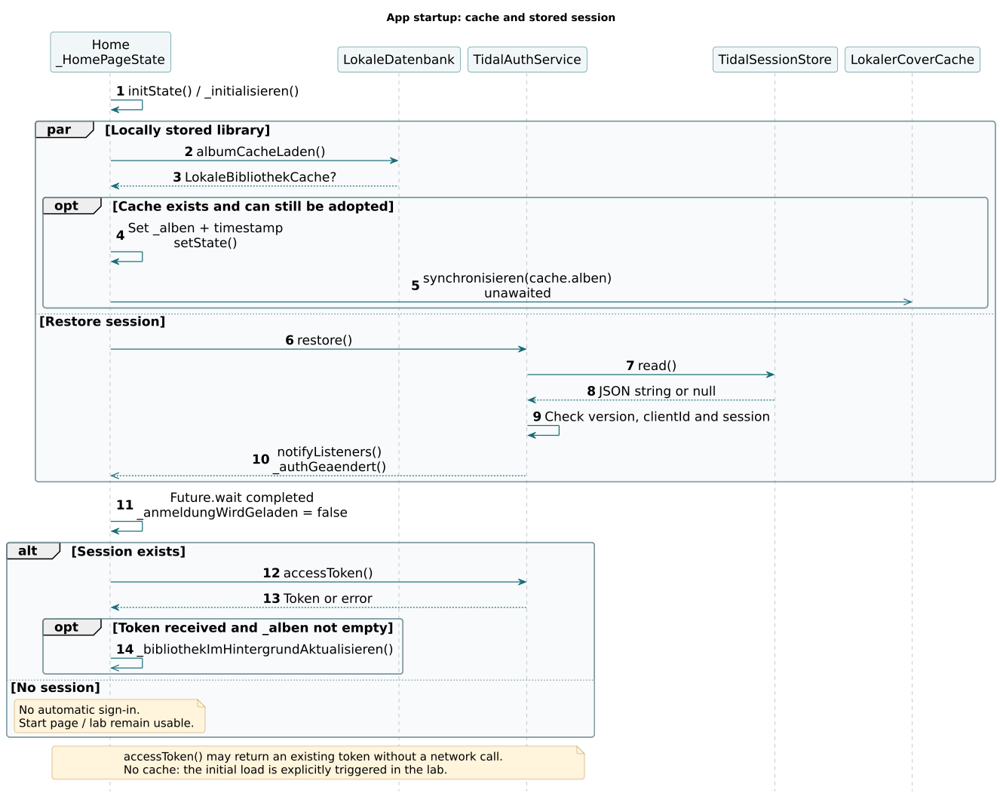

## 07 · Interactive sign-in and secure storage

Successful sign-in and successful persistent storage are two different results. This distinction prevents false promises about the next app startup.

**Source locations:** pages/home_page.dart: _login(); services/tidal_auth_service.dart: acceptLogin(), _persist()

[PlantUML](PlantUML/07_Sequenz_Anmeldung.puml) · [SVG](SVG/07_Sequenz_Anmeldung.svg) · [PNG](PNG/07_Sequenz_Anmeldung.png)

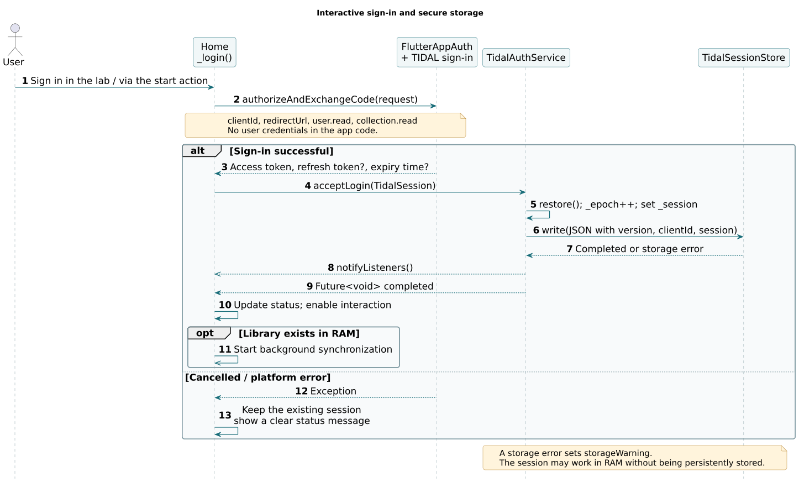

## 08 · Loading the library: foreground and background

During background synchronisation, the old view is retained until the complete new state is available. Foreground loading, by contrast, displays subsets that have already been read.

**Source locations:** pages/home_page.dart: _albenLaden(), _bibliothekImHintergrundAktualisieren(); data/lokale_datenbank.dart: albumCacheSpeichern()

[PlantUML](PlantUML/08_Sequenz_Bibliothek.puml) · [SVG](SVG/08_Sequenz_Bibliothek.svg) · [PNG](PNG/08_Sequenz_Bibliothek.png)

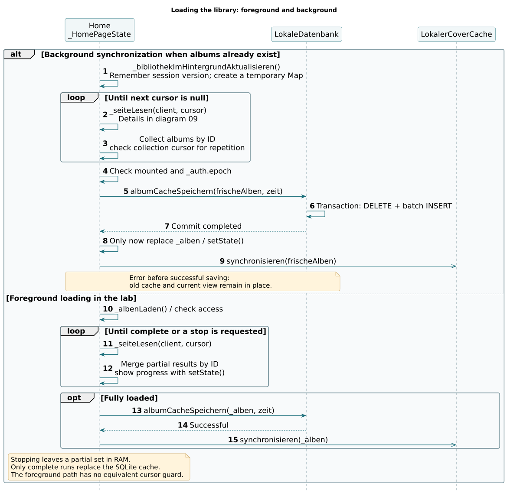

## 09 · From JSON resources to Album objects

Collection IDs and album metadata come from separate requests. The resource index resolves the relationships to artists and covers.

**Source locations:** pages/home_page.dart: _seiteLesen(); services/tidal_api.dart; models/modelle.dart: Album.ausRessourcen()

[PlantUML](PlantUML/09_Sequenz_Albumseite.puml) · [SVG](SVG/09_Sequenz_Albumseite.svg) · [PNG](PNG/09_Sequenz_Albumseite.png)

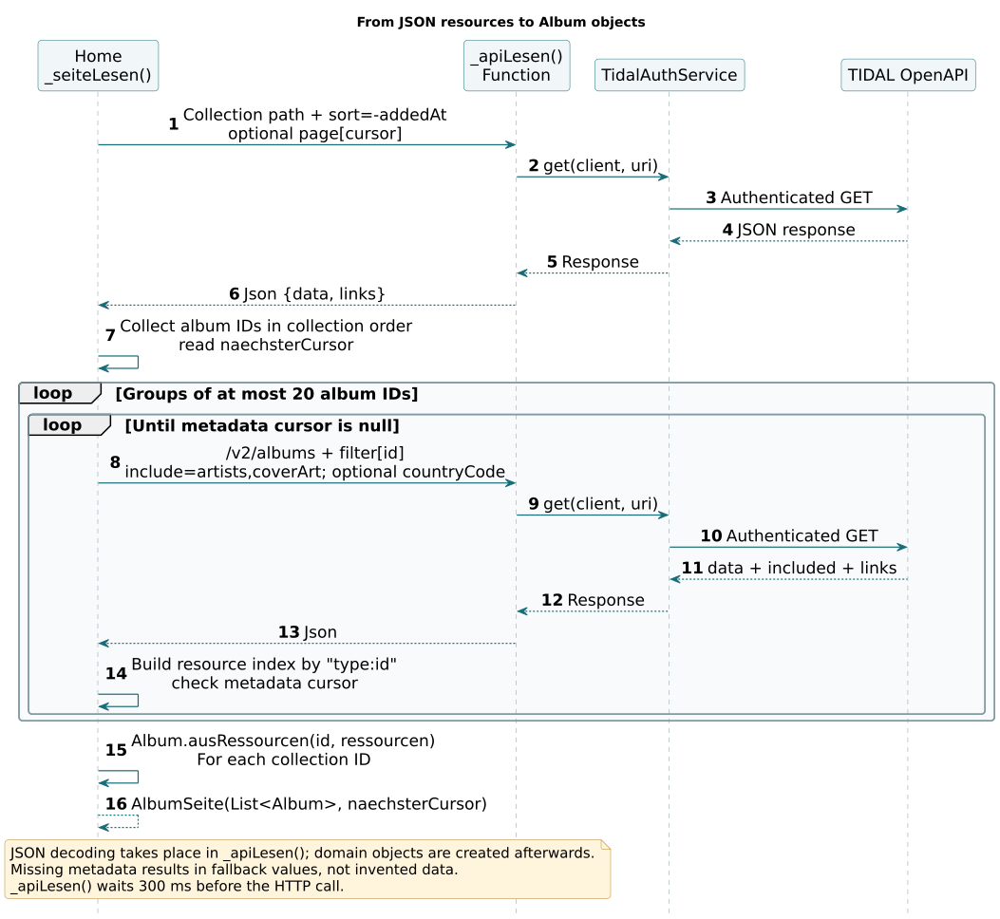

## 10 · API 401: refresh once and retry

A network error is not evidence of an invalid sign-in. Concurrent calls share the refresh; a second rejection ends without an infinite loop.

**Source locations:** services/tidal_auth_service.dart: get(), accessToken(), _refresh(), _persist()

[PlantUML](PlantUML/10_Sequenz_Token401.puml) · [SVG](SVG/10_Sequenz_Token401.svg) · [PNG](PNG/10_Sequenz_Token401.png)

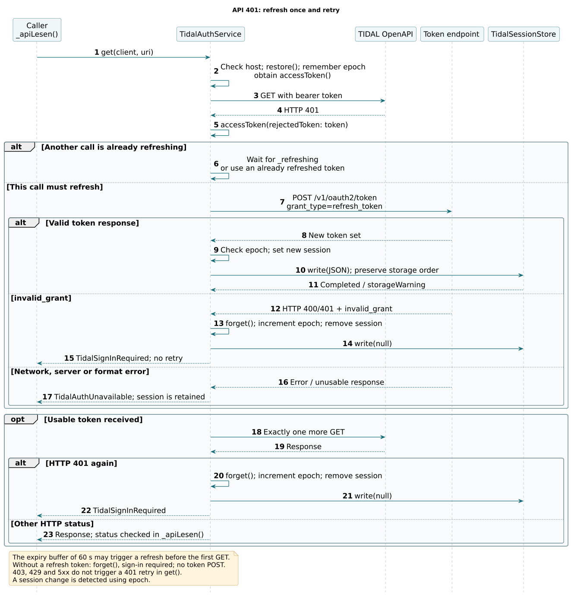

## 11 · Editing and saving sort names in bulk

No saving on every keystroke: a confirmed change list is written together. The page knows only its save callback, not the specific SQL.

**Source locations:** pages/home_page.dart: _kuenstlerSortiernamenOeffnen(); pages/kuenstler_sortiernamen_page.dart; models/kuenstler_sortierung.dart; data/kuenstler_sortierung_speichern.dart

[PlantUML](PlantUML/11_Sequenz_Kuenstlereditor.puml) · [SVG](SVG/11_Sequenz_Kuenstlereditor.svg) · [PNG](PNG/11_Sequenz_Kuenstlereditor.png)

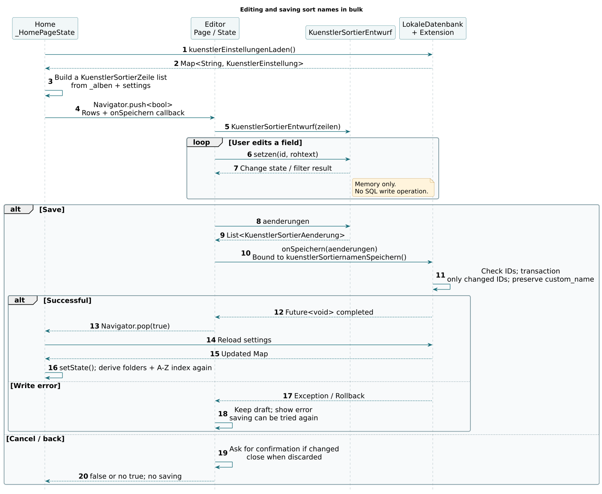

## 12 · Assigning an album to several categories

The checkboxes return only IDs. The detail page then initiates the transaction and reports the change to parent pages.

**Source locations:** pages/album_detail_page.dart: _kategorienBearbeiten(); widgets/dialoge.dart; data/lokale_datenbank.dart: albumKategorienSetzen()

[PlantUML](PlantUML/12_Sequenz_Kategorien.puml) · [SVG](SVG/12_Sequenz_Kategorien.svg) · [PNG](PNG/12_Sequenz_Kategorien.png)

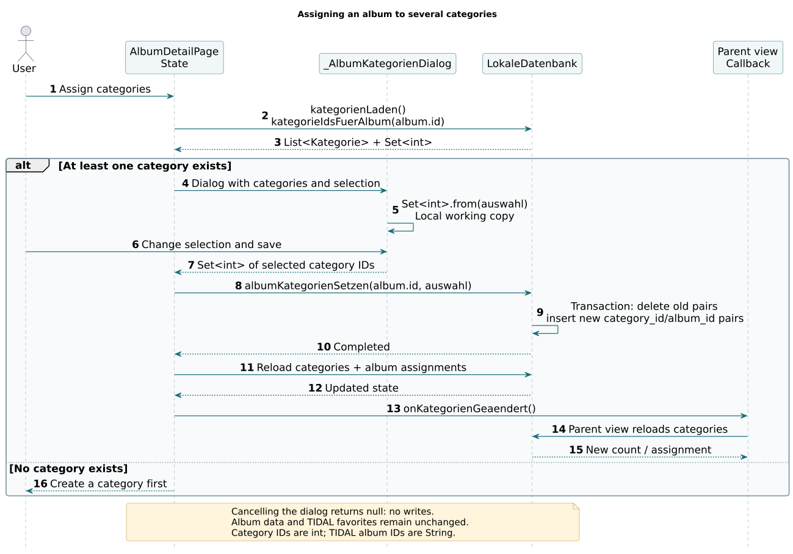

## 13 · Cover display: file, download and fallback

A File is not an album record. The UI receives a file or null; cover requests do not use an OAuth Bearer header.

**Source locations:** services/cover_cache.dart; widgets/album_cover.dart

[PlantUML](PlantUML/13_Sequenz_Cover.puml) · [SVG](SVG/13_Sequenz_Cover.svg) · [PNG](PNG/13_Sequenz_Cover.png)

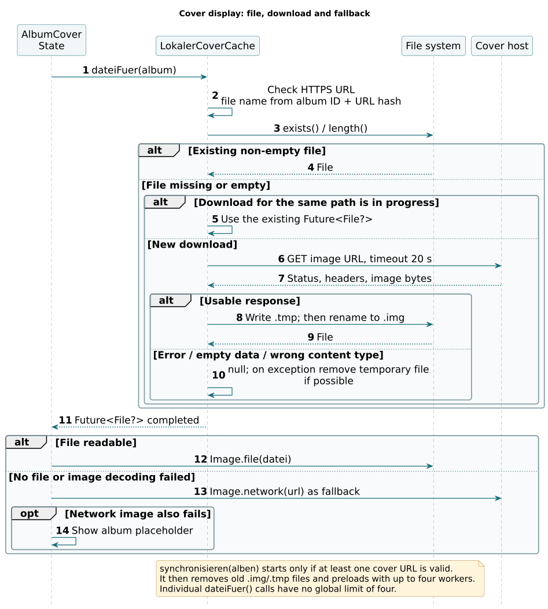

## 14 · Loading album details and handing off to TIDAL

The track list and categories come from different sources. An external link hands off to another app and is not a music player implemented here.

**Source locations:** pages/album_detail_page.dart: initState(), _titelLaden(), _inTidalOeffnen(), _titelInTidalOeffnen()

[PlantUML](PlantUML/14_Sequenz_Details_Wiedergabe.puml) · [SVG](SVG/14_Sequenz_Details_Wiedergabe.svg) · [PNG](PNG/14_Sequenz_Details_Wiedergabe.png)

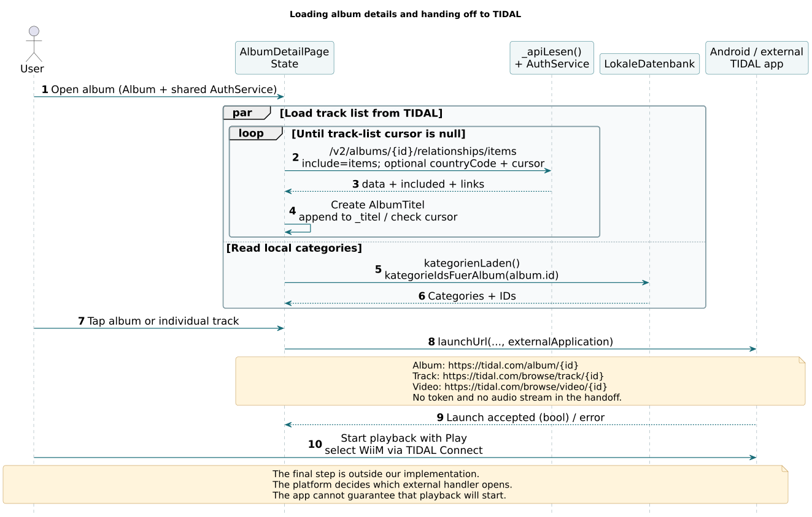
